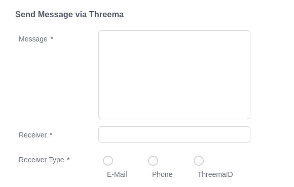
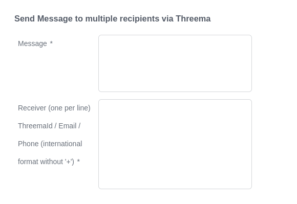
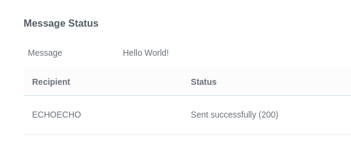

# Threema Connector
Axon Ivy's Threema Connector enables you to send end-to-end encrypted messages by integrating the [Threema.Gateway API](https://threema.ch/en/gateway) provided by Threema. With this connector you are able to send messages to one or more recipients using email, phone number or ThreemaID as identifier.

Credentials and credits are required to send messages. The credentials can be created free of charge at [Threema.Gateway](https://gateway.threema.ch/en/signup). Credits can then be bought in accordance with usage. More info can be found at [Threema.Gateway API](https://threema.ch/en/gateway).

## Demo






## Setup
1. Generate a new key pair using the "createKeyPair" process.
2. Create "End-to-End Threema ID" at: [Request new ID](https://gateway.threema.ch/en/id-request) <br> 
Free credits for testing purposes can be requested at [support-gateway@threema.ch](mailto:support-gateway@threema.ch) <br>
3. Add the following variables to your Axon Ivy Project:

```
@variables.yaml@
```
